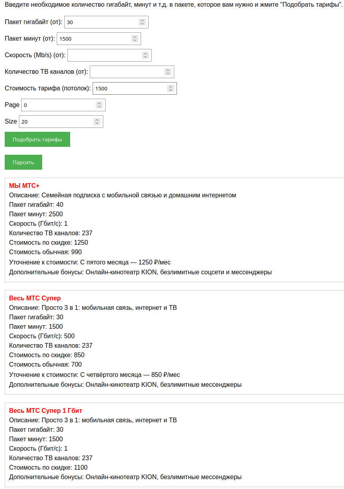

**- _Сервис развернут на выделенном сервере по адресу_ http://91.196.7.31:8080/tariffs**

**- _Репозиторий с исходным кодом_ https://github.com/LLaym/tariffparser**


# :bookmark: TariffParser - парсер МТС тарифов с функцией подбора

**TariffParser** - сервис-парсер. Основная функция сервиса - сбор информации об актуальных тарифах и подбор наиболее
подходящего пользователю тарифа.
Программа предоставляет пользовательский UI для работы с приложением, открываемый в браузере.

**Стек приложения:** Java 11, Spring Boot, JPA, Thymeleaf, PostgreSQL, Jsoup, Lombok, JUnit5, H2

**Интерфейс программы:**



## :checkered_flag: Установка и запуск

### :package: Используя Docker (рекомендуется)

Для запуска **TariffParser** требуются следующие шаги:

1. Установить [Docker](https://www.docker.com/) на локальную машину.
2. Склонировать репозиторий проекта.
3. Перейти в корневую директорию проекта.
4. Собрать проект при помощи **Maven**:

```bash
mvn clean package
```
4. Запустить Docker Compose команду:

```bash
docker compose up --build

# --build: Пересобрать образы перед запуском
```

6. Приложение будет доступно по адресу http://localhost:8080/tariffs.

## :bulb: API приложения

- ```POST /parseTariffs``` - сбор тарифов и обновление данных.
- ```GET /tariffs``` - получение списка тарифов.